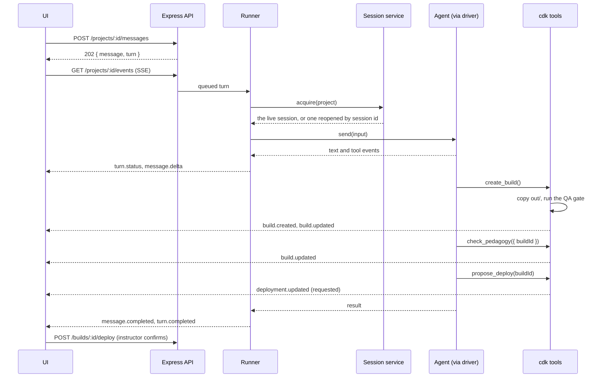

# Architecture

> **Status: proposal for team review** (drafted 2026-09-10). This file is the contract the front-end and back-end tracks build against. Change it by PR. Keeping it accurate matters more than keeping it complete. The first slice to build is scoped in [v1.md](v1.md); what was verified about each agent is in [drivers.md](drivers.md); the words used throughout are defined in [Terms](#terms) at the end.

## The split

The app is two programs, built by two tracks, that meet only at the HTTP API and the event stream defined in this document.

- **Front end** — the browser app. Per project it shows the chat, a small configurator (title, target course, source files), a build panel (preview, QA gate findings, pedagogy check findings), and a deployment confirmation. It renders what the back end returns and runs no checks itself. V1 ships one text box; the full chat uses the same API, so nothing below changes when the UI grows.
- **Back end** — an Express service. Owns identity, projects, chats, turns, builds, deployments, the QA gate, the pedagogy check, and the D2L client. It drives the agent (Claude first, Copilot later) through a driver in `back-end/src/agent/`, and exposes its own capabilities to the agent as tools. The agent decides, per message, whether to edit the output, run a check, create a build, or just answer. The same code runs in local mode and in hosted mode (see [Modes](#modes)).

The instructor is not a developer. They make exactly one kind of decision in the whole flow, confirming a deployment, and they make it in the build panel, not the chat. The agent never asks them to approve a tool.

## Resource model

The resource model is what the back end stores and the HTTP API exposes, and how those things relate. Everything an instructor does creates or changes one of them. A project holds one chat. Messages, turns, files, builds, and events all hang off it.

```
User ─< Project ─┬─< Message
                 ├─< Turn
                 ├─< File
                 ├─< Build ─< Deployment
                 └─< Event   (append-only, one sequence per project)
```

| Resource | Fields (abridged) | Notes |
|---|---|---|
| **User** | `id, displayName, email?, role` | One row in local mode |
| **Project** | `id, ownerId, title, avenue?, targetCourse?, sessionId?, createdAt, updatedAt` | `avenue` may stay null until the agent's router skill settles it. `sessionId` is the agent's identifier for this project's session, used to reopen it |
| **Message** | `id, projectId, seq, role, content[], turnId?, createdAt` | `role` is `instructor \| agent`. `content` is a list of blocks (below) |
| **Turn** | `id, projectId, messageId, replyId?, status, startedAt?, finishedAt?, error?, usage?` | `messageId` is the instructor's message, `replyId` the agent's. `status` is `queued \| running \| completed \| failed \| cancelled` |
| **File** | `id, projectId, name, mime, size, createdAt` | Instructor uploads: syllabus, assignment text, images |
| **Build** | `id, projectId, version, status, avenue, qa, pedagogy?, turnId?, createdAt` | `status` is `checking \| ready \| failed`. `qa` is `{ passed, findings[] }`. `pedagogy` is `{ tilt[], udl[] }` once the pedagogy check has run on this build, otherwise null |
| **Deployment** | `id, buildId, status, targetCourse, location?, verification?, turnId?, confirmedAt?, createdAt` | `status` is `requested \| confirmed \| deploying \| verified \| failed`. Only the instructor moves it past `requested` |
| **Event** | `seq, projectId, turnId?, kind, payload, ts` | What the event stream carries. Replayable by `seq` |

Message content blocks:

```ts
type ContentBlock =
  | { type: 'text'; text: string }
  | { type: 'file'; fileId: string }               // instructor attachment
  | { type: 'build_ref'; buildId: string }         // agent: "here is build 3"
  | { type: 'deployment_ref'; deploymentId: string };
```

Storage: one SQLite database in the app-data folder. Per project on disk:

```
<dataDir>/projects/<projectId>/
  workspace/                where the agent works
    files/                  instructor uploads
    out/                    the output; the only thing a build copies
  builds/<version>/         builds: copies of out/ with qa.json and pedagogy.json
```

Anything agent-specific inside the workspace, such as Claude's `.claude/` directory and `CLAUDE.md`, is written by the driver when it opens a session, never by provisioning. See [Workspaces](#workspaces).

## HTTP API

The HTTP API is the request/response contract between the front end and the back end. The front end is its only client, and everything the front end can do goes through it, except receiving live progress, which is the event stream's job.

All routes are under `/api`, JSON in and out. One auth middleware runs before every route and sets `req.user`: in local mode it returns the single OS user, in hosted mode it reads the cookie set by the OIDC login. Every query below the middleware filters on `req.user.id`, so hosted mode is a WHERE clause, and local mode is the same code with one instructor.

Errors use one envelope: `{ "error": { "code": "...", "message": "...", "details"?: {} } }` with the usual status codes. Lists are cursor-paginated (`?cursor=&limit=`).

### Identity

Who is calling, and which agent this install runs.

```
GET  /api/me              → { user, mode: 'local'|'hosted', agent: { name, ok, version?, detail? } }
GET  /api/health
```

### Projects and files

Creating and managing projects, and the instructor's uploads into them.

```
GET    /api/projects                        → { items: Project[] }
POST   /api/projects                        { title, targetCourse?, avenue? } → 201 { project }
GET    /api/projects/:projectId             → { project, builds: [summary], latestDeployment?, activeTurn? }
PATCH  /api/projects/:projectId             { title?, targetCourse?, avenue? }
DELETE /api/projects/:projectId             → 204
POST   /api/projects/:projectId/files       multipart → 201 { file }
GET    /api/projects/:projectId/files       → { items: File[] }
```

### Chat

Sending a message, and controlling the turn it starts.

```
GET    /api/projects/:projectId/messages    ?cursor=&limit= → { items: Message[], nextCursor? }
POST   /api/projects/:projectId/messages    { content: ContentBlock[] }
                                            → 202 { message, turn }
                                            → 409 { error.code: 'turn_active', details: { turnId } }
POST   /api/turns/:turnId/cancel            → 202
```

Posting a message never blocks on the agent. It stores the message, creates a queued turn, and returns. Progress arrives on the event stream. One turn runs per project at a time; the client disables send while `activeTurn` exists.

### Builds and deployments

Reading builds, creating one without the agent, running the pedagogy check on one, and the human gate for deployments.

```
GET    /api/projects/:projectId/builds        → { items: Build[] }
POST   /api/projects/:projectId/builds        { note? } → 202 { build }     instructor-triggered, no agent involved
GET    /api/builds/:buildId                   → { build, deployments: [] }
POST   /api/builds/:buildId/pedagogy          → 202 { build }               runs the pedagogy check on this build
GET    /api/builds/:buildId/preview/*         the preview (iframe target)
GET    /api/builds/:buildId/download          the build as a zip, for manual upload
POST   /api/builds/:buildId/deploy            { targetCourse?, confirm: true } → 202 { deployment }
GET    /api/deployments/:deploymentId         → { deployment }
```

A build always runs the QA gate. The pedagogy check is a separate step on a build, requested by the instructor here or by the agent through its tool, so an intermediate build costs nothing it does not need.

`POST /builds/:id/deploy` is the **human gate**. The agent can propose a deployment; only this call, made by the instructor, executes one. The D2L write happens in `back-end/src/deploy/`, never inside the agent.

### Checks without the agent

```
POST   /api/checks/pedagogy    { text } | { fileId } → { tilt: Finding[], udl: Finding[] }
```

Goal 4 in the proposal: the pedagogy check on assignment text without building anything. The same implementation backs the build-level check and the agent's tool.

## Event stream

The event stream is how the back end pushes progress to the front end while a turn runs, over Server-Sent Events. One event stream per project. Everything asynchronous the UI needs to show arrives here; everything else is plain request/response.

```
GET /api/projects/:projectId/events           SSE. Honors Last-Event-ID (or ?after=<seq>)
```

Each event: `id` is the project-wide `seq`, `event` is the kind, `data` is JSON. The server replays events after the client's last seen `seq` from the database, then attaches to the live feed. That single rule makes refresh, a second tab, reconnects, and server restarts all work. A comment line is sent every 15 seconds as keepalive.

| kind | payload | When |
|---|---|---|
| `turn.started` | `{ turnId }` | The runner picked the turn up |
| `turn.status` | `{ turnId, text }` | Plain-language progress: "Reading your syllabus…", "Checking accessibility…" |
| `message.delta` | `{ turnId, messageId, text }` | Streamed agent text |
| `message.completed` | `{ message }` | The agent's full message is stored |
| `tool.started` | `{ turnId, callId, name, summary }` | The agent called a tool |
| `tool.finished` | `{ turnId, callId, ok, summary, buildId? }` | The tool returned |
| `build.created` | `{ build }` | A new build exists (status `checking`) |
| `build.updated` | `{ build }` | QA gate report attached, pedagogy check report attached, or failed |
| `deployment.updated` | `{ deployment }` | Any status change, including `requested` from the agent |
| `turn.completed` | `{ turnId, usage? }` | |
| `turn.failed` | `{ turnId, error }` | |
| `turn.cancelled` | `{ turnId }` | |

The UI derives its build panel from `build.*` and `deployment.*` events plus the Build and Deployment resources. It never parses chat text for structure.

## A turn, end to end

A turn is the agent's work in response to one instructor message. This section follows one from the message arriving to the instructor confirming a deployment, naming the component responsible for each step.



Runner rules:

1. One active turn per project. Per-instructor concurrency cap: 1 in local mode, configurable in hosted mode. Extra turns wait in `queued`.
2. Every driver event becomes an Event row **and** a live push, in that order.
3. When the driver's result arrives: store the agent's message, save the session id on the Project, mark the turn.
4. `POST /turns/:id/cancel` and the per-turn wall-clock limit both fire the turn's abort signal. The driver stops the agent; the runner records `cancelled` or `failed`.
5. On boot, any turn still `running` becomes `failed` with `error.code = 'interrupted'`. The UI offers to resend.
6. The runner compares the workspace service's hash of `out/` before and after each turn. A turn that changed it and created no build gets one at turn end, with the QA gate and without the pedagogy check. This is what makes the single-text-box UI work without relying on the agent to remember.

Not every message produces a build. A question gets an answer. A request to change a colour edits the output and produces a new build. The agent's clarifying questions are ordinary messages; the next instructor message continues the chat.

## Tools

Tools are the functions the back end exposes to the agent, so that the agent acts on a project through the back end, which records what happened, rather than around it. Defined once in `back-end/src/tools/`, served two ways: in-process for a driver that supports it, or as a standalone MCP server over stdio for one that does not. The agent sees them as `mcp__cdk__<name>`.

| Tool | Does | Side effect |
|---|---|---|
| `get_project` | Returns title, avenue, target course, tenant constraints, uploaded files, prior builds | none |
| `create_build({ note? })` | Copies `out/` and runs the QA gate | Build row, `build.*` events |
| `get_build({ buildId })` | Full findings for a build | none |
| `check_pedagogy({ buildId } \| { text })` | The pedagogy check on a build or on pasted text | On a build: report attached, `build.updated` |
| `propose_deploy({ buildId, note })` | Records that the agent thinks this build is ready | Deployment row in `requested`, `deployment.updated` |

Tool handlers are created per session with the project and instructor already bound, so a tool can never touch another project. Skills reach the agent through the driver, which delivers the kit's skills the way its agent takes them (see [Workspaces](#workspaces)).

**The agent runs on a fixed allowlist and is never prompted.** Pre-approved: file tools inside the workspace, the shell commands the skills need (such as the QA gate), and the `cdk` tools. Everything else is denied automatically and the agent is told so in the tool result, so it adapts or explains in its message. Each driver maps this onto its agent's own permission model (see [drivers.md](drivers.md)). No driver is ever run with an "approve everything" setting.

## Sessions

A session is an open exchange between a driver and its agent for one project: the agent running, or ready to run, in that project's workspace, with the agent's own session id so it remembers the chat. Sessions exist so a project keeps its context between messages without the back end holding a process for every project.

A project's session has two durable parts: the workspace and the `sessionId` on the Project. Both agents persist their transcripts on disk and reopen them by session id. Whether a process is alive between two messages is a separate question, answered by the session service.

**Who owns what.** The workspace service owns directories: it creates a workspace when a project is created, reports its path, and removes it when the project is deleted. The session service owns processes and session ids: it opens a session in an existing workspace, keeps it while it is useful, and closes it. Workspaces outlive sessions and are used without one, by file uploads, instructor-triggered builds, downloads, and previews, which is why the two are separate components.

The flow across a project's life:

1. `POST /projects` inserts the Project row, and the workspace service provisions the workspace.
2. The first message makes the runner call `acquire(projectId)`. The session service gets the workspace path from the workspace service and opens a session through the driver with `sessionId: null`. The driver delivers the instructions, the skills, and the permission rules the way its agent takes them, then starts the agent. It reports the agent's session id with the turn's result, and the runner stores it on the Project.
3. A later message, after the idle timer has closed the session, goes through `acquire` again: same workspace, stored session id, and the driver reopens the agent's transcript in it.
4. `DELETE /projects/:id` closes any live session, removes the workspace, and deletes the rows.

A project whose workspace is missing cannot run a turn; the turn fails with `error.code = 'workspace_missing'`. The workspace is never recreated silently, because that would discard the output.

**The session service** (`src/pipeline/`) hands the runner an open session per project and owns process lifetime:

1. `acquire(projectId)` returns the live session for the project, or opens one in the project's workspace with the Project's `sessionId` (null the first time).
2. A session is busy while a turn runs. A second message during that time gets `409 turn_active`.
3. After a turn the service saves the session id on the Project and starts a fixed idle timer, 15 minutes to begin with. On expiry it closes the session and releases whatever process it held.
4. A process that dies mid-turn fails the turn and drops the session. The next message reopens it by session id.
5. Live sessions are capped for memory. At the cap, the least recently used idle session is closed early.
6. On boot the table is empty. Every project reopens from its stored session id on first use.

**What a turn costs when no process is alive.** Starting the agent means launching its binary, loading the workspace settings and skills, and connecting the tools. Expect on the order of a second or two before the first token; measure it rather than assume. Reading the transcript back from disk on reopen is local file I/O and costs nothing worth noticing. The prompt cache is a different thing from both: it lives on the model provider's servers, is keyed by the exact request prefix, and expires minutes after its last use. A process kept alive between turns does not keep it warm; only the gap between two messages decides whether the next request hits it. So the case for a live process is startup latency on quick follow-ups, and the cost is memory per idle process. The service above makes that a contained trade-off.

**The driver interface** is in [`back-end/src/agent/AgentDriver.ts`](../back-end/src/agent/AgentDriver.ts):

```ts
interface AgentDriver {
  name: 'claude' | 'copilot';
  probe(): Promise<{ ok: boolean; version?: string; detail?: string }>;
  open(req: SessionRequest): Promise<AgentSession>;
}
interface AgentSession {
  sessionId: string | null;                  // known after the first turn
  send(input, limits, signal): AgentTurn;    // { events, result }
  close(): Promise<void>;
}
```

The runner and the session service talk only to this interface. Whether a driver keeps a process alive inside an open session is its own choice; the Claude driver does, the Copilot driver holds a client per workspace, and [drivers.md](drivers.md) records why. Each driver absorbs its agent's gaps internally: a driver that cannot stream emits one text delta at the end; one that cannot take attachments references the uploaded files by path. If a stored session id cannot be reopened, the driver starts a new session in the workspace and emits a `notice` so the instructor sees "starting a fresh chat". The instructions carry the project facts, and the `get_project` tool carries the live ones, so a new session loses only chat history, never the project.

## Workspaces

A workspace is the directory where the agent works on one project. It holds the instructor's uploads, the output the agent writes, and whatever the driver puts there for its agent. Everything the agent reads or writes for a project lives inside it, and the confinement layers below keep the agent from reaching anything outside it.

**Provisioning.** The workspace service, called by `POST /projects`, creates the tree shown under [Resource model](#resource-model): `files/` empty, and `out/` holding the kit's starter for the avenue once the avenue is known. The same service copies `out/` into a build, hashes `out/` so the runner can tell whether a turn changed it, and removes the tree when the project is deleted. Nothing it writes is specific to an agent.

**Agent files.** Each agent takes its instructions, its skills, and its permission rules in its own way, so the driver delivers them at every `open`, and provisioning never writes them. The instructions are generated by the back end from the project facts and the kit's rules (write the output into `out/`, respect the tenant profile). The skills come from the kit as installed. The permission rules are those in the confinement layers below. The Claude driver writes all three into the workspace, as `CLAUDE.md`, `.claude/skills/`, and `.claude/settings.json`, because that is where Claude reads them. The Copilot driver passes all three as session options, `systemMessage`, `skillDirectories` pointing at the kit, and the tool allowlist, and writes nothing. Delivering at every open means an install can switch agents, a change to the project facts reaches the agent at its next session, and a fix to a skill reaches every project at its next session.

**Builds.** `create_build` copies `out/` into `builds/<version>/` and runs the QA gate over the copy. Preview and download serve from the build, so the instructor sees something stable while the agent keeps editing the output. Retention: every deployed build is kept, plus the newest ten others. Deleting a project removes the whole tree.

**Confinement, in layers.** The agent runs with the instructor's own permissions in local mode and as the service account in hosted mode, so it is kept inside its workspace by construction rather than by trust. The layers are cumulative; each stays in place when the next is added.

1. **Run inside the workspace, with a deny-by-default permission mode.** The driver starts the agent in the workspace with a mode that approves the allowlist and denies everything else without prompting.
2. **Permission rules**, delivered by the driver the way its agent takes them. Allow reads, edits, and searches under the workspace. Deny reads of the home directory's credentials and agent configuration and of the app's data directory outside this project. Allow only the shell commands the skills need.
3. **A pre-tool hook** in the driver, running in-process, that resolves every path in a tool input and denies anything outside the workspace's real path. This backstops the rules against `..` and symlinks.
4. **The agent's own OS sandbox**, which confines shell commands to the workspace and blocks network access except an allowlist. Which agent supports which operating system is in [drivers.md](drivers.md). Enable it wherever the agent supports the host, configured to refuse to run rather than run unconfined.
5. **Containers.** If hosted mode must isolate instructors from each other more strongly than the sandbox does, the driver runs each session in a container with the workspace mounted, a network allowlist (the model API and the D2L tenant), and CPU, memory, and disk limits. The driver then spawns the agent inside the container; nothing above the driver changes.

Layers 1 to 3 ship with V1. Layer 4 is on wherever the agent supports the host. Layer 5 is a driver-internal decision for hosted mode.

**Bounds per turn.** The runner passes a step limit and a dollar budget, which the driver enforces through its agent, and enforces wall-clock time itself through the abort signal.

**Agent state.** Each agent keeps transcripts, settings, and sign-in under its own configuration directory, listed per agent in [drivers.md](drivers.md). In local mode, leave the defaults so the instructor's existing sign-in is used. In hosted mode, point each at a directory owned by the service account so state has one known home; transcripts are already separated per project because every agent keys them by workspace.

**Windows.** Local mode runs on the instructor's Windows machine. Keep the data directory short, `%LOCALAPPDATA%\CDK`, to stay under path-length limits. The commands in the skills must work in both PowerShell and bash, because the agents differ in which shell they use. Copy builds with a retry, because the preview server or antivirus can hold a file open for a moment.

## Modes

A mode is where the app runs and for whom. Local mode runs the whole app on one instructor's own machine, for that instructor alone. Hosted mode runs it on a campus server, for many instructors at once. Both run the same code; the table lists the only things that differ, and every one of them is configuration.

| Concern | Local mode | Hosted mode |
|---|---|---|
| Identity | Stub user from the OS account | OIDC login, `express-session` cookie in SQLite |
| Request guard | Bind 127.0.0.1; random launch token required in a header; Origin checked | TLS, cookie, CSRF token |
| Database | SQLite in app data | Same SQLite; Postgres only if it outgrows it |
| Workspaces | Under the instructor's data folder | Per-instructor directory tree |
| Agent sandbox | Layers 1 to 3, plus layer 4 where the agent supports Windows | Layers 1 to 4 |
| Agent sign-in | The instructor's own | A shared service account, or per instructor |
| D2L credentials | One token | One token per instructor, stored server-side |
| Concurrency | One turn at a time | Per-instructor cap, plus a cap on live sessions |

The launch token matters even in local mode: any website open in the instructor's browser can send requests to localhost. The app serves the page with the token embedded; every API call sends it back in a header; the server rejects anything else.

## Back-end folders

How `back-end/src` is laid out, so that each concern above has exactly one home.

| Folder | Role |
|---|---|
| `src/routes/` | HTTP only: parse, validate (zod), call one service, shape the response |
| `src/services/` | Projects, messages, builds, deployments, and the workspace service. Receives plain arguments, never `req`/`res` |
| `src/pipeline/` | The runner, the session service, and event fan-out |
| `src/agent/` | `AgentDriver` and the drivers |
| `src/tools/` | The `cdk` tool handlers, plus the in-process and stdio adapters |
| `src/tilt-udl/` | The pedagogy check |
| `src/deploy/` | The D2L client and verification |
| `src/db/` | SQLite schema and repositories |
| `kit/harness/` | The QA gate and the emulator, called by `tools/` and `builds` |

Wiring lives in one `createApp(deps)` function. `server.js` calls it with real drivers; tests call it with fakes.

## V1

V1 is the first end-to-end version: the smallest slice of this design that takes an instructor's request to a usable file. What it includes, what it deliberately leaves out, and the order the rest is added in are in [v1.md](v1.md).

## Terms

Every document in `docs/` and every comment in `back-end/src/` uses these words, and no synonyms for them.

| Term | Meaning |
|---|---|
| **instructor** | The person using the app. Stored as a **User**. |
| **project** | One piece of course content and its chat, owned by one instructor. |
| **chat** | The messages of a project. |
| **message** | One entry in a chat, from the instructor or from the agent. |
| **turn** | The agent's work in response to one instructor message. |
| **agent** | The program that builds the output on the instructor's behalf: Claude or Copilot. |
| **driver** | The back-end module that speaks one agent's SDK. |
| **session** | An open exchange between a driver and its agent for one project. The agent's own identifier for it is the **session id**. |
| **runner** | The back-end component that executes turns. |
| **session service** | The back-end component that opens, hands out, and closes sessions. |
| **workspace** | The project's directory, where the agent works. |
| **workspace service** | The back-end component that creates, locates, and removes workspaces. |
| **output** | The contents of `out/` in the workspace: the course content the project produces. |
| **build** | An immutable copy of the output that has been through the QA gate. |
| **QA gate** | The kit's static check of a build against the tenant profile, implemented by `kit/harness/lint`. |
| **pedagogy check** | The TILT and UDL check, run on a build or on pasted text. |
| **deployment** | Placing a build into a D2L course. |
| **kit** | The D2L Content Development Kit in `back-end/kit`: skills, QA gate, emulator, probes. |
| **skill** | A guide in the kit that the agent follows to build one avenue. |
| **instructions** | The project facts and the kit's rules, generated by the back end and delivered to the agent by the driver at every session open. |
| **avenue** | One of the ways content can live in D2L: `topic`, `scorm`, `widget`, `external`. |
| **emulator** | The kit's local reproduction of the tenant's D2L behavior. |
| **preview** | A build rendered through the emulator. |
| **tool** | A function the back end exposes to the agent. |
| **event stream** | The per-project Server-Sent Events feed. |
| **local mode** | The app running on the instructor's own machine, for one instructor. |
| **hosted mode** | The app running on a campus server, for many instructors. |
| **V1** | The first end-to-end version, scoped in [v1.md](v1.md). |
